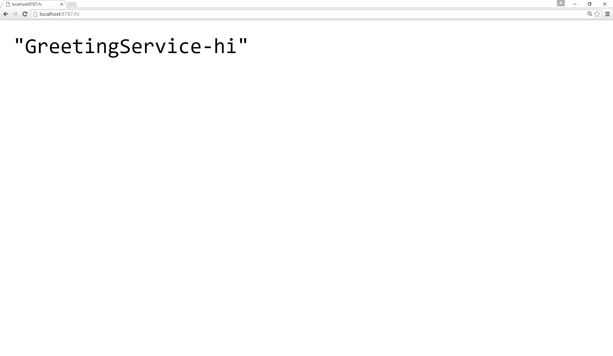

# apollo-project

Apollo project is a project template. It can be used with the [project-x](https://github.com/foldik/project-x) project generator.

## Install

```
$ npm install --save apollo-project
```

## API
### apolloProject(settings)

#### settings.name
The name of the project root folder. This will be the artifactId too.

#### settings.groupId
The groupId int the pom.xml.

#### settings.package
The root package of the java application.

#### settings.serviceName
The beginning of the service class.

#### settings.method
The name of the service method.

#### settings.port
The port number, where the service started.

## Example
#### index.js
```js
const {apolloProject} = require('apollo-project');
const {project} = require('project-x');

var projectTemplate = apolloProject(
    {
        'name': 'hello-app',
        'groupId': 'com.foldik',
        'package': 'com.foldik.example',
        'serviceName': 'Greeting',
        'method': 'hi',
        'port': '8787'
    }
);

project(projectTemplate).build();
```

#### Generated project structure

```
hello-app/
  pom.xml
  src/
    main/
      java/
        com.foldik.example/
          App.java
          module/
            Module.java
          service/
            GreetingService.java
          logger/
            Logger.java
      resources/
        hi.conf
```

Now you can build the project with maven and start the application.
```
$ mvn clean package
```

```
$ java -jar target/hello-app-1.0-SNAPSHOT.jar
```

You can reach the service on [localhost:8787/hi](http://localhost:8787/hi)

# 

## License
ISC
